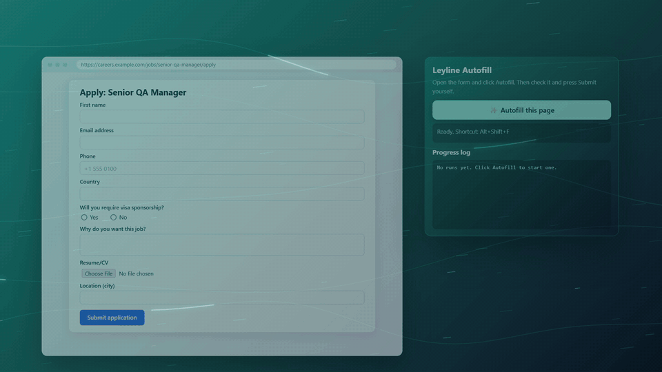
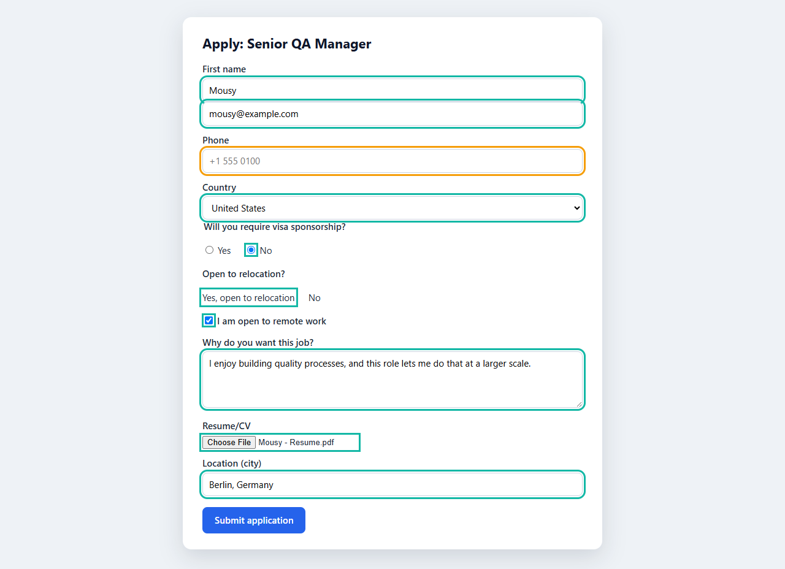
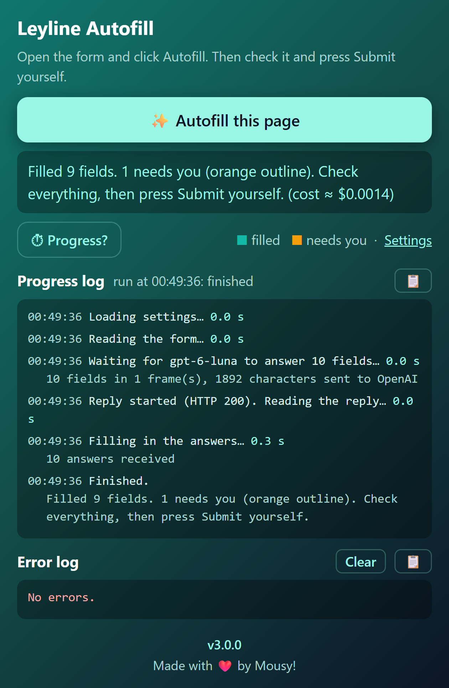
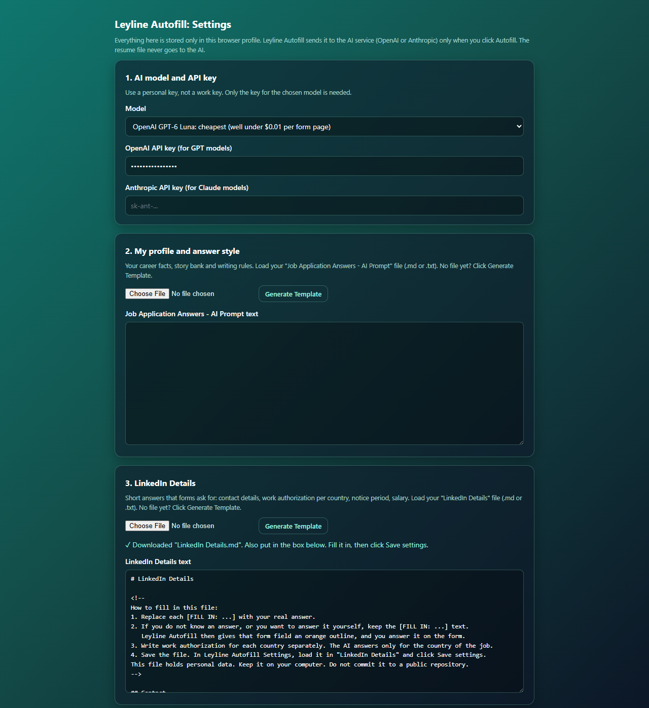

# Leyline Autofill

**One click fills a job application form with AI. You review it and press Submit yourself.**

A browser extension for Firefox, Chrome and Edge. It reads the form on the current page, asks the AI model of your choice
(OpenAI GPT or Anthropic Claude) for the answers, and writes them in. It never presses Submit.

[](docs/media/leyline-autofill-launch.mp4)

*Click the animation to watch the 20-second launch video (MP4).*

## Screenshots

| A filled form | The popup | Settings |
|---|---|---|
|  |  |  |

Teal outline = filled by Leyline Autofill. Orange outline = you must answer it (hover the field to see why).

## Features

- **One click or one shortcut.** Click the toolbar button or press **Alt+Shift+F**. It runs only when you ask.
- **Any website.** It reads any HTML form generically, with no per-site code, and is built for LinkedIn Easy Apply
  dialogs and company career sites. It handles text boxes, drop-downs, radio buttons, checkboxes, search boxes
  with pop-up lists, and resume upload boxes. (Early version: it is tested on a sample form, not yet on many live sites.
  Please report a site where it fails.)
- **Never submits.** It never clicks Submit, Next or Apply. You always check the answers and send the application.
- **Never guesses.** If a fact is unknown, the field gets an orange outline instead of an invented answer.
  Consent checkboxes and demographic questions are always left to you, unless your LinkedIn Details file answers them.
- **Work authorization per country.** The AI answers visa and sponsorship questions for the country of the job,
  only from what your LinkedIn Details file says.
- **Open questions in your voice.** "Why do you want this job?" answers follow the rules and stories in your
  Job Application Answers - AI Prompt file, tailored to the job page.
- **Attaches your resume** to resume or CV upload boxes. The resume file goes to the website only, never to the AI.
- **Generate Template buttons** in Settings download starter files with `[FILL IN: ...]` placeholders.
- **Progress log and Error log** in the popup, each with a 📋 copy button, and a **Progress?** button that asks the
  extension what it is doing right now. The copied text never contains your API key.
- **Low cost.** With GPT-6 Luna, one form page costs well under one US cent. The popup shows the cost of each autofill.

## What you need

1. **Your resume file**: PDF (recommended), DOC or DOCX.
2. **`LinkedIn Details.md`** (or `.txt`): short facts that forms ask for, such as contact details, work authorization
   per country, notice period and salary. Click *Generate Template* in Settings to get a starter file.
3. **`Job Application Answers - AI Prompt.md`** (or `.txt`): your background, your writing rules and a story bank
   for "tell me about a time" questions. Click *Generate Template* in Settings to get a starter file.
4. **Your own API key** from [OpenAI](https://platform.openai.com/api-keys) or [Anthropic](https://console.anthropic.com/).

In both text files, keep `[FILL IN: ...]` for anything you want to answer yourself. Those fields get an orange outline.

## Install

Download the latest version from this repository's **Releases** page.

**Chrome or Edge**
1. Download the `.zip` file and unzip it.
2. Open `chrome://extensions` (Chrome) or `edge://extensions` (Edge).
3. Set **Developer mode** to on.
4. Click **Load unpacked** and select the unzipped folder (the folder that contains `manifest.json`).
5. Pin Leyline Autofill to the toolbar.

**Firefox**
1. Download the signed `.xpi` file and open it in Firefox. Click **Add**.
2. Until a signed `.xpi` is on the Releases page: open `about:debugging#/runtime/this-firefox`, click
   **Load Temporary Add-on…** and select `manifest.json` in the unzipped folder. Firefox removes a temporary
   add-on when it closes.

Firefox 142 or newer and Chrome or Edge 121 or newer are necessary.

## Setup

1. Click the Leyline Autofill icon, then click **Settings**.
2. Choose a model and paste your API key.
3. In **Job Application Answers - AI Prompt**, load your file (or click *Generate Template*, fill it in, then load it).
4. In **LinkedIn Details**, load your file (or click *Generate Template*, fill it in, then load it).
5. In **Resume file**, select your resume.
6. Click **Save settings**.

Each browser keeps its own settings. Do the setup once in each browser that you use.

## How it works

1. You open an application form and click **✨ Autofill this page**.
2. Leyline Autofill reads the form fields on the page. If a dialog with a form is open (for example LinkedIn Easy Apply),
   it reads only the dialog, so it does not touch the site's search boxes.
3. It sends the field list, the job page text and your two text files to the AI model, and asks for a strict JSON answer:
   one value and one status for each field (`filled`, `needs_user` or `skip`).
4. It writes the values into the form with real input events, so React, Angular and Vue forms accept them.
   Filled fields get a teal outline. Fields that need you get an orange outline with a note.
5. You check everything and press Submit yourself. For multi-page forms, click Autofill again on each page.

## Privacy

- **Your keys and files stay in your browser.** Settings are kept in the extension's local storage in your browser profile.
  There is no Leyline Autofill server.
- **Data goes to the AI provider only when you click Autofill**: the form fields, the job page text and your two text files.
  It goes directly from your browser to OpenAI or Anthropic, with your own key.
- **Your resume never goes to the AI.** Leyline Autofill attaches it directly to the website's upload box.
- **It never submits a form**, never applies automatically and never searches for jobs. You stay in control of every application.
- The Progress log and Error log never contain your API key, and page addresses in them have the query part removed.

## Development

The extension is plain JavaScript (Manifest V3). There is no build step: the `extension/` folder is the extension,
the same folder for all three browsers.

```text
extension/   manifest.json, background.js, filler.js, popup, options (Settings), templates.js, icons
tests/       Playwright tests (Python) and a sample job form
docs/        README images, the launch video, and the script that makes the screenshots
```

Run the tests (Python 3.11+ with `pytest` and `playwright`; run `python -m playwright install` once):

```bash
python -m pytest tests -v
```

Lint the extension (Node.js is necessary):

```bash
npx -y web-ext lint --source-dir extension
```

One warning is expected: `BACKGROUND_SERVICE_WORKER_IGNORED`. The manifest lists both a Firefox background script
and a Chrome/Edge service worker on purpose.

Make the README screenshots again (fake data only, no real AI call):

```bash
python docs/capture_screenshots.py
```

`AGENTS.md` has the full requirements, design decisions and rules for contributors and AI coding agents.

## License

[GNU General Public License v3.0](LICENSE) (GPL-3.0). You may use, change and share it; shared changed versions must stay open source under the same licence.
